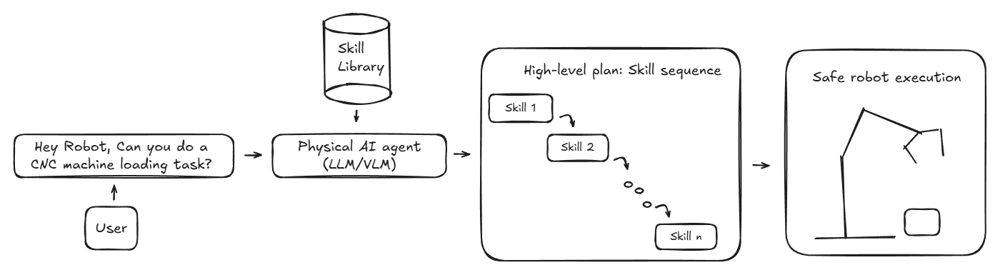
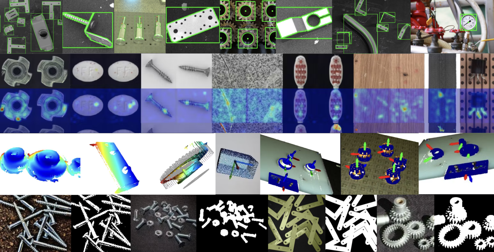
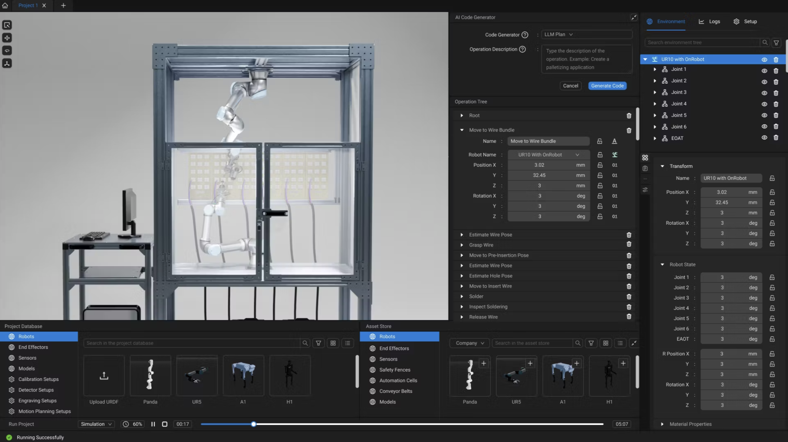

<div align="center">
  <p>
    <a href="https://github.com/telekinesis-ai" target="_blank">
      
    </a>
  </p>

  <p align="center">
    <a href="https://pypi.org/project/telekinesis-ai/">
      
    </a>
    <a href="https://pypi.org/project/telekinesis-ai/">
      
    </a>
    <a href="https://pypi.org/project/telekinesis-ai/">
      
    </a>
    <a href="https://docs.telekinesis.ai">
      
    </a>
  </p>

  <h2>Any robot. Any task. One Physical AI platform.</h2>

  <p>
    <a href="https://docs.telekinesis.ai/">Telekinesis Docs</a>
    &nbsp;•&nbsp;
    <a href="https://discord.gg/S5v8bYAnc6">Discord</a>
    &nbsp;•&nbsp;
    <a href="https://www.linkedin.com/company/telekinesis-ai/">LinkedIn</a>
    &nbsp;•&nbsp;
    <a href="https://x.com/telekinesis_ai">X</a>
    &nbsp;•&nbsp;
    <a href="https://telekinesis.ai/">Website</a>

</p>
</div>

# Telekinesis Agentic Skill Library for Computer Vision, Robotics and Physical AI

<video src="assets/application-vitreous-point-cloud-processing.mp4" autoplay loop muted playsinline style="width: 100%; aspect-ratio: 16/9; object-fit: cover; border-radius: 1rem;"></video>

<p style="font-size: 0.875rem; color: #6b7280; margin-top: 0.5rem; text-align: center;">
  Telekinesis Agentic Skill Library for Computer Vision, Robotics and Physical AI applications
</p>

The [**Telekinesis Agentic Skill Library**](https://docs.telekinesis.ai/) is the first large-scale Python library for building agentic robotics, computer vision, and Physical AI systems. It provides:

- **Skills**: a broad set of AI algorithms for perception, motion planning, and control.
- **Physical AI Agents**: LLM/VLM agents for task planning across industrial, mobile, and humanoid robots.

The library is intended for robotics, computer vision, and research teams that want to:

- Speed up development by integrating production-grade robotics, computer vision, and AI algorithms
- Add intelligence to robots with LLM/VLM-driven task planning tied to real perception and control systems
- Iterate quickly on Physical AI systems using a single, consistent Python library

This repository provides **Python examples** demonstrating Telekinesis Skills—atomic operations you can chain into pipelines for real-world applications. Each example is standalone, readable, and composable.

> **Tip:** A free API key is required. Create one at [platform.telekinesis.ai](https://platform.telekinesis.ai/api-keys). See the [Quickstart Guide](https://docs.telekinesis.ai/getting-started/quickstart.html) for details.


## The Telekinesis Community

The Agentic Skill Library and Brainwave are just the beginning. We're building a community of contributors who grow the Physical AI Skill ecosystem—researchers, hobbyists, and engineers alike. If you have a Skill, we want to see it. Release it, let others use and improve it, and watch it deploy in real-world systems.

[Join our Discord community](https://discord.gg/S5v8bYAnc6) to connect, share, and build together.


## Table of Contents

- [What is a Skill?](#what-is-a-skill)
- [What is a Physical AI Agent?](#what-is-a-physical-ai-agent)
- [How do Physical AI Agents use Skills?](#how-do-physical-ai-agents-use-skills)
- [What Can You Build?](#what-can-you-build)
- [Control Any Robot](#control-any-industrial-robot-mobile-robot--humanoid-with-a-unified-python-interface)
- [Production-Grade Computer Vision](#production-grade-computer-vision-models-for-robotics-and-physical-ai-systems)
- [Getting Started](#getting-started)
- [Example Categories](#example-categories)
- [Directory Structure](#directory-structure)
- [Who We Are](#who-we-are)


## What is a Skill?

A [Skill](https://docs.telekinesis.ai/getting-started/skills.html) is a reusable operation for robotics, computer vision, and Physical AI. Skills span 2D/3D perception (6D pose estimation, 2D/3D detection, segmentation, image processing), motion planning (RRT*, motion generators, trajectory optimization), and motion control (model predictive control, reinforcement learning policies). Skills can be **chained into pipelines** to build real-world robotics applications.

**Example 1: Calculate point cloud centroid** — [docs](https://docs.telekinesis.ai/vitreous_sdk/calculate_point_cloud_centroid.html)

```python
from telekinesis import vitreous

centroid = vitreous.calculate_point_cloud_centroid(point_cloud=point_cloud)
```

**Example 2: Apply Gaussian blur to an image** — [docs](https://docs.telekinesis.ai/pupil_sdk/filter_image_using_gaussian_blur.html)

```python
from telekinesis import pupil

blurred_image = pupil.filter_image_using_gaussian_blur(
    image=image,
    kernel_size=7,
    sigma_x=3.0,
    sigma_y=3.0,
    border_type="default",
)
```

Skills are organized in [**Skill Groups**](https://docs.telekinesis.ai/getting-started/skills.html). Each can be imported from the `telekinesis` library:

```python
from telekinesis import vitreous   # point cloud processing skills
from telekinesis import retina     # object detection skills
from telekinesis import cornea     # image segmentation skills
from telekinesis import pupil      # image processing skills
from telekinesis import illusion   # synthetic data generation skills
from telekinesis import iris       # AI model training skills
from telekinesis import neuroplan  # robotics skills
from telekinesis import medulla    # hardware communication skills
from telekinesis import cortex     # physical AI agents
```

### [Vitreous: 3D point cloud processing](https://docs.telekinesis.ai/vitreous_sdk/vitreous_overview.html)
```python
from telekinesis import vitreous
```
- **Point cloud:** centroids, normals, bounding boxes, principal axes
- **Filtering:** masks, outliers, downsampling, plane & cylinder removal
- **Segmentation:** DBSCAN, density, color, plane-based clustering
- **Transforms:** rigid transforms, scaling, projection
- **Registration:** ICP (P2P, P2Plane), global registration, cuboid sampling
- **Meshes:** shapes, mesh to point cloud, convex hull, Poisson reconstruction

### [Pupil: 2D image processing](https://docs.telekinesis.ai/pupil_sdk/pupil_overview.html)
```python
from telekinesis import pupil
```
- **Morphology:** erode, dilate, open/close, gradient, top-hat
- **Structure:** Frangi, Hessian, Sato, Meijering
- **Edges:** Sobel, Scharr, Laplacian, Gabor
- **Denoising:** Gaussian, median, bilateral, box filters
- **Enhancement:** CLAHE, gamma correction, white balance
- **Transforms:** pyramids, mask thinning

### [Retina: Object detection](https://docs.telekinesis.ai/retina/overview.html)
```python
from telekinesis import retina
```
- Foundation-model based object detection • Classical object detection

### [Cornea: Image segmentation](https://docs.telekinesis.ai/cornea/overview.html)
```python
from telekinesis import cornea
```
- Foundation model–based, deep learning, and classical segmentation

### [Illusion: Synthetic data generation](https://docs.telekinesis.ai/illusion/overview.html)
```python
from telekinesis import illusion
```
- Synthetic image data generation for AI model training

### [Iris: AI model training and deployment](https://docs.telekinesis.ai/iris/overview.html)
```python
from telekinesis import iris
```
- AI model training pipelines • Fine-tuning and evaluation of foundation models

### [Neuroplan: Robotics](https://docs.telekinesis.ai/neuroplan/overview.html)
```python
from telekinesis import neuroplan
```
- Kinematics • Motion planning • Control • Robot database

### [Cortex: Physical AI Agents](https://docs.telekinesis.ai/cortex/overview.html)
```python
from telekinesis import cortex
```
- Action & Skill graphs • Physical AI Agents for skill graph generation and execution

### [Brainwave: Physical AI Platform](https://docs.telekinesis.ai/brainwave/overview.html)
- Skill & Agent orchestration • Simulation, digital twins, sim-to-real workflows • Monitoring and logging


## What is a Physical AI Agent?

Recent advances in LLMs and VLMs have shown the potential of learned models to perform semantic reasoning, task decomposition, and high-level planning from vision and language inputs.

In the Telekinesis library, a **Physical AI Agent**—typically a Vision Language Model (VLM) or Large Language Model (LLM)—autonomously interprets natural language instructions and generates high-level **Skill plans**. In autonomous Physical AI systems, Agents continuously produce and execute Skill plans, allowing the system to operate with minimal human intervention.

To learn more, explore [Cortex](https://docs.telekinesis.ai/cortex/overview.html).


## How do Physical AI Agents use Skills?



<p style="font-size: 0.875rem; color: #6b7280; margin-top: 8px;">
  Telekinesis Agentic Skill Library Architecture
</p>

**Flow Overview**

1. A user prompts the robot with a task: *"Hey, can you do a CNC machine loading task?"*
2. The Agent interprets the intent and reasons over the given task and sequencing.
3. The Agent constructs a high-level plan and orchestrates the Skills—selecting order and parameters.
4. Skills are executed on the robot using production-grade **perception, motion, and control algorithms**, with continuous feedback from the environment.

## What Can You Build?

<video src="assets/application-automated-relay-soldering.mp4" autoplay loop muted playsinline style="width: 100%; aspect-ratio: 16/9; object-fit: cover; border-radius: 1rem;"></video>

<p style="font-size: 0.875rem; color: #6b7280; margin-top: 0.5rem; text-align: center;">
  Automated relay soldering powered by Physical AI
</p>

**Telekinesis Agentic Skill Library** helps you build **real-world robotics and Physical AI applications** for industries such as manufacturing, automotive, aerospace, and others. Below are use cases the Telekinesis team has deployed using the skill library.

| Example Use Case | Description |
|----------|-------------|
| **Automated Basil Harvesting** | Vision-based manipulation for agricultural robotics in unstructured outdoor environments. Detect plants, estimate grasp poses, execute adaptive closed-loop motions. |
| **Carton Palletizing** | Vision-guided palletizing that adapts to changing layouts and product variations. Object detection, pose estimation, and motion planning for accurate placement. |
| **Automated Assembly** | Multi-step assembly combining task planning, coordinated manipulation, and precise motion execution. |
| **Vision-Based Quality Control** | Industrial computer vision for defect detection, dimensional verification, and surface analysis. |

<div style="display: grid; grid-template-columns: repeat(2, 1fr); gap: 1.5rem; margin: 2rem 0;">
  <div>
    <video src="assets/application-automated-basil-harvesting.mp4" autoplay loop muted playsinline style="width: 100%; aspect-ratio: 16/9; object-fit: cover; border-radius: 1rem;"></video>
    <p style="font-size: 0.875rem; color: #6b7280; margin-top: 0.5rem; text-align: center;">Automated Basil Harvesting</p>
  </div>
  <div>
    <video src="assets/application-carton-palletizing.mp4" autoplay loop muted playsinline style="width: 100%; aspect-ratio: 16/9; object-fit: cover; border-radius: 1rem;"></video>
    <p style="font-size: 0.875rem; color: #6b7280; margin-top: 0.5rem; text-align: center;">Carton Palletizing</p>
  </div>
  <div>
    <video src="assets/application-auto-assemble.mp4" autoplay loop muted playsinline style="width: 100%; aspect-ratio: 16/9; object-fit: cover; border-radius: 1rem;"></video>
    <p style="font-size: 0.875rem; color: #6b7280; margin-top: 0.5rem; text-align: center;">Automated Assembly</p>
  </div>
  <div>
    <video src="assets/application-quality-control.mp4" autoplay loop muted playsinline style="width: 100%; aspect-ratio: 16/9; object-fit: cover; border-radius: 1rem;"></video>
    <p style="font-size: 0.875rem; color: #6b7280; margin-top: 0.5rem; text-align: center;">Vision-Based Quality Control</p>
  </div>
</div>


## Control Any Industrial Robot, Mobile Robot & Humanoid with a Unified Python Interface

One of the biggest pains of robotics is that each robot provider has their own interface. Telekinesis offers [**Neuroplan**](https://docs.telekinesis.ai/neuroplan/overview.html)—a skill group that provides a unified interface to control any industrial, mobile, or humanoid robot.

**Supported:** Universal Robots, KUKA, ABB, Franka Emika (real & simulation); Boston Dynamics, Anybotics, Unitree (simulation).

```python
from telekinesis import neuroplan  # robotics skills
```

**Prototype** on any robot, **perform** any task on the same platform, and **deploy** the same Skill Groups anywhere—*any robot, any task, on one Physical AI platform.*

<video src="assets/simulation-robots.mp4" autoplay loop muted playsinline style="width: 100%; aspect-ratio: 16/9; object-fit: cover; border-radius: 1rem;"></video>

<p style="font-size: 0.875rem; color: #6b7280; margin-top: 0.5rem; text-align: center;">
  Telekinesis supports industrial, mobile and humanoid robots
</p>


## Production-Grade Computer Vision Models for Robotics and Physical AI Systems

The library offers **production-grade computer vision Skill Groups** for object detection, segmentation, pose estimation, synthetic data generation, and AI model training.

```python
from telekinesis import vitreous   # point cloud processing skills
from telekinesis import retina     # object detection skills
from telekinesis import cornea     # image segmentation skills
from telekinesis import pupil      # image processing skills
from telekinesis import illusion   # synthetic data generation skills
from telekinesis import iris       # AI model training skills
from telekinesis import medulla    # sensor interface skills
```

<div style="display: grid; grid-template-columns: 1fr 1fr; gap: 2rem; align-items: center; margin: 2rem 0;">
  
  <div>
    <p style="font-size: 1.25rem; font-weight: 600; margin-bottom: 1rem;">2D Image Processing, Object Detection & Segmentation</p>
    <p>Build reusable 2D vision pipelines using <a href="https://docs.telekinesis.ai/pupil_sdk/pupil_overview.html">Pupil</a> for low-level image processing, <a href="https://docs.telekinesis.ai/retina/overview.html">Retina</a> for object detection, and <a href="https://docs.telekinesis.ai/cornea/overview.html">Cornea</a> for segmentation and mask generation. These Skill Groups can be composed into standalone perception pipelines for images, video, or sensor data.</p>
  </div>
</div>

<div style="display: grid; grid-template-columns: 1fr 1fr; gap: 2rem; align-items: center; margin: 2rem 0;">
  <div>
    <p style="font-size: 1.25rem; font-weight: 600; margin-bottom: 1rem;">3D Point Cloud Processing & Mesh Generation</p>
    <p>Develop geometric alignment pipelines using <a href="https://docs.telekinesis.ai/vitreous_sdk/vitreous_overview.html">Vitreous</a> to register point clouds or meshes against reference models or scenes. Vitreous provides reusable registration Skills—ICP-based alignment, global registration—enabling precise localization and model-to-scene matching.</p>
  </div>
  <video src="assets/vision-icp-registration.mp4" autoplay loop muted playsinline style="width: 100%; aspect-ratio: 16/9; object-fit: cover; border-radius: 1rem;"></video>
</div>

<div style="display: grid; grid-template-columns: 1fr 1fr; gap: 2rem; align-items: center; margin: 2rem 0;">
  <video src="assets/vision-3d-object-detection.mp4" autoplay loop muted playsinline style="width: 100%; aspect-ratio: 16/9; object-fit: cover; border-radius: 1rem;"></video>
  <div>
    <p style="font-size: 1.25rem; font-weight: 600; margin-bottom: 1rem;">3D Object Detection & 6D Pose Estimation</p>
    <p>Create 3D object detection and 6D pose estimation pipelines by combining <a href="https://docs.telekinesis.ai/retina/overview.html">Retina</a> for object detection with <a href="https://docs.telekinesis.ai/vitreous_sdk/vitreous_overview.html">Vitreous</a> for point cloud filtering, registration, and geometric pose estimation—for grasp planning, inspection, and vision-guided manipulation.</p>
  </div>
</div>

<div style="display: grid; grid-template-columns: 1fr 1fr; gap: 2rem; align-items: center; margin: 2rem 0;">
  <div>
    <p style="font-size: 1.25rem; font-weight: 600; margin-bottom: 1rem;">Synthetic Data Generation & AI Model Training</p>
    <p>Generate photo-realistic synthetic image datasets for training object detection, segmentation, and classification models using the <a href="https://docs.telekinesis.ai/illusion/overview.html">Illusion</a> skill group. Train state-of-the-art AI models in the cloud and deploy them to real-world systems using the <a href="https://docs.telekinesis.ai/iris/overview.html">Iris</a> skill group.</p>
  </div>
  
</div>


## Brainwave: the Telekinesis Physical AI Platform

[**Brainwave**](https://docs.telekinesis.ai/brainwave/overview.html) is the Telekinesis Physical AI cloud platform for managing skill orchestration, simulation, digital twins, and robot deployments from a single system. It enables agent-based robotics systems to be developed, deployed, and operated at scale across heterogeneous robots and tasks.



Develop and simulate digital twin workflows to validate, stress-test, and optimize Skill Groups. Deploy the same Skill Groups to real-world robots using a simulation-to-real transfer pipeline.

<div style="display: grid; grid-template-columns: repeat(3, 1fr); gap: 1.5rem; margin: 2rem 0;">
  <div>
    <video src="assets/simulation-cnc-machine-tending.mp4" autoplay loop muted playsinline style="width: 100%; aspect-ratio: 16/9; object-fit: cover; border-radius: 1rem;"></video>
    <p style="font-size: 0.875rem; color: #6b7280; margin-top: 0.5rem; text-align: center;">CNC Machine Tending</p>
  </div>
  <div>
    <video src="assets/simulation-pick-and-place.mp4" autoplay loop muted playsinline style="width: 100%; aspect-ratio: 16/9; object-fit: cover; border-radius: 1rem;"></video>
    <p style="font-size: 0.875rem; color: #6b7280; margin-top: 0.5rem; text-align: center;">Pick and Place</p>
  </div>
  <div>
    <video src="assets/simulation-polishing.mp4" autoplay loop muted playsinline style="width: 100%; aspect-ratio: 16/9; object-fit: cover; border-radius: 1rem;"></video>
    <p style="font-size: 0.875rem; color: #6b7280; margin-top: 0.5rem; text-align: center;">Surface Polishing</p>
  </div>
  <div>
    <video src="assets/simulation-welding.mp4" autoplay loop muted playsinline style="width: 100%; aspect-ratio: 16/9; object-fit: cover; border-radius: 1rem;"></video>
    <p style="font-size: 0.875rem; color: #6b7280; margin-top: 0.5rem; text-align: center;">Robotic Welding</p>
  </div>
  <div>
    <video src="assets/simulation-metal-palletizing.mp4" autoplay loop muted playsinline style="width: 100%; aspect-ratio: 16/9; object-fit: cover; border-radius: 1rem;"></video>
    <p style="font-size: 0.875rem; color: #6b7280; margin-top: 0.5rem; text-align: center;">Metal Palletizing</p>
  </div>
  <div>
    <video src="assets/simulation-palletizing.mp4" autoplay loop muted playsinline style="width: 100%; aspect-ratio: 16/9; object-fit: cover; border-radius: 1rem;"></video>
    <p style="font-size: 0.875rem; color: #6b7280; margin-top: 0.5rem; text-align: center;">Palletizing</p>
  </div>
</div>

## Getting Started

You can easily integrate the **Telekinesis Agentic Skill Library** into your own application. Set up the library in just 4 steps and start building!

### Requirements

- Python 3.11 or 3.12
- A Telekinesis account and API key

### Step 1: Create an API Key

Since all Skills are hosted in the cloud, you need a free API key to access them securely. Create a Telekinesis account and generate an API key: [Create API Key](https://platform.telekinesis.ai/api-keys)

Store the key in a safe location, such as your shell configuration file (e.g. `.zshrc`, `.bashrc`) or another secure location on your computer.

### Step 2: Configure the API Key

Export the API key as an environment variable. Open a terminal and run the command below for your operating system.

> **Note:** Replace `your_api_key` with the key you generated in Step 1.

```bash
# macOS / Linux
export TELEKINESIS_API_KEY="your_api_key"
```

```powershell
# Windows
setx TELEKINESIS_API_KEY "your_api_key"
```

> **Note:** After running `setx` on Windows, restart your terminal for the changes to take effect.

The Telekinesis Agentic Skill Library uses this API key to authenticate requests and automatically reads it from your system environment.

### Step 3: Install the Telekinesis Agentic Skill Library

We support Python 3.11 and 3.12. Ensure your environment uses one of these versions.

Install the library using `pip`:

```bash
pip install telekinesis-ai
```

### Step 4: Run Your First Example

1. Clone the `telekinesis-examples` repository (including the data submodule):


```bash
git clone --depth 1 --recurse-submodules --shallow-submodules https://github.com/telekinesis-ai/telekinesis-examples.git
```

> **About shallow clone:**
>
> - This command downloads only the latest commit of the main repository and its submodules, making the process much faster and using less disk space.
> - You get all the latest code and data, but not the full git history.
> - This is ideal for most users, CI/CD, and quick testing.
> - If you want the full commit history (for development or advanced git operations), use:
>
>   ```bash
>   git clone --recurse-submodules https://github.com/telekinesis-ai/telekinesis-examples.git
>   ```

This also downloads the [telekinesis-data](https://gitlab.com/telekinesis/telekinesis-data) repository, which contains sample point clouds, meshes, and images. You can replace this with your own data when using Telekinesis in your projects. Download time may vary depending on your connection.

2. Change into the repository directory:

```bash
cd telekinesis-examples
```

3. Install example dependencies:

```bash
pip install numpy scipy opencv-python rerun-sdk==0.27.3 loguru
```

4. Run the [voxel downsampling](https://docs.telekinesis.ai/vitreous_sdk/filter_point_cloud_using_voxel_downsampling.html) example:

```bash
python examples/vitreous_examples.py --example filter_point_cloud_using_voxel_downsampling
```

If the example runs successfully, a **Rerun** visualization window will open showing the input and filtered point cloud. Rerun is a visualization tool for 3D data and processing results.

<video src="assets/voxel_downsample_input_output.mp4" autoplay loop muted playsinline style="width: 100%; aspect-ratio: 16/9; object-fit: cover; border-radius: 1rem;"></video>

### List Available Examples

```bash
python examples/vitreous_examples.py --list   # Vitreous (3D point cloud & mesh)
python examples/pupil_examples.py --list      # Pupil (2D image processing)
```

### Run a Specific Example

```bash
python examples/vitreous_examples.py --example calculate_axis_aligned_bounding_box
python examples/pupil_examples.py --example filter_image_using_morphological_gradient
```

### Use Your Own Data

1. Create a directory with `images/`, `point_clouds/`, and `meshes/` subdirectories. See the [Skills documentation](https://docs.telekinesis.ai/getting-started/skills.html) for more on data formats.
2. Update `DATA_DIR` in [vitreous_examples.py](examples/vitreous_examples.py) or [pupil_examples.py](examples/pupil_examples.py).
3. Update the `file_name` variable to your input file.
4. Run the example.

## Example Categories

### Telekinesis Agentic Skill Library Modules

| Module | Description | Status |
|--------|-------------|--------|
| [**Vitreous**](https://docs.telekinesis.ai/vitreous_sdk/vitreous_overview.html) | 3D point cloud & mesh processing | Released |
| [**Pupil**](https://docs.telekinesis.ai/pupil_sdk/pupil_overview.html) | 2D image processing | Released |
| [**Retina**](https://docs.telekinesis.ai/retina/overview.html) | Object detection (foundation models, classical) | Planned — Feb 2026 |
| [**Cornea**](https://docs.telekinesis.ai/cornea/overview.html) | Image segmentation | Planned — Feb 2026 |
| [**Illusion**](https://docs.telekinesis.ai/illusion/overview.html) | Synthetic data generation | Planned — Feb 2026 |
| [**Iris**](https://docs.telekinesis.ai/iris/overview.html) | Model training & fine-tuning | Planned — Feb 2026 |
| [**Neuroplan**](https://docs.telekinesis.ai/neuroplan/overview.html) | Motion planning, kinematics, control | Planned — Feb 2026 |
| [**Cortex**](https://docs.telekinesis.ai/cortex/overview.html) | Task planning & skill composition | Planned — Mar 2026 |
| [**Brainwave**](https://docs.telekinesis.ai/brainwave/overview.html) | End-to-end robotic solutions | Planned — Apr 2026 |


## Directory Structure

```
telekinesis-examples/
├── examples/
│   ├── datatypes_examples.py   # Data types & transformations
│   ├── vitreous_examples.py    # 3D point cloud & mesh Skills
│   └── pupil_examples.py       # 2D image processing Skills
├── telekinesis-data/           # Git submodule (sample data)
│   ├── images/
│   ├── point_clouds/
│   └── meshes/
├── assets/
├── README.md
└── LICENSE.txt
```


## Who We Are

We're a team of passionate robotics and computer vision experts who care about the details. Industry veterans who know the frustration of systems that just don't work. All of us asking the same question: why is robotics still so hard to use?

[Telekinesis](https://telekinesis.ai/) began as a spin-off from the [Intelligent Autonomous Systems Lab](https://www.ias.informatik.tu-darmstadt.de/Main/LandingPage?from=Main.HomePage) at TU Darmstadt, led by [Prof. Jan Peters](https://scholar.google.com/citations?user=-kIVAcAAAAAJ&hl=en), and is supported by people with years of experience at KUKA and Universal Robots.


## Next Steps

Ready to go further? Explore the Agentic Skill Library, dive into specific modules, or connect with the community.

- [Documentation](https://docs.telekinesis.ai) — Full Agentic Skill Library reference and guides
- [Quickstart](https://docs.telekinesis.ai/getting-started/quickstart.html) — Step-by-step setup
- [Vitreous Skills](https://docs.telekinesis.ai/vitreous_sdk/vitreous_overview.html) — 3D point cloud processing
- [Pupil Skills](https://docs.telekinesis.ai/pupil_sdk/pupil_overview.html) — 2D image processing
- [Discord](https://discord.gg/S5v8bYAnc6) — Ask questions, share feedback, connect with users

## Support

- [GitHub Issues](https://github.com/telekinesis-ai/telekinesis-examples/issues) — Report bugs or request features
- [Create API Key](https://platform.telekinesis.ai/api-keys) — Get started with the Telekinesis platform
- [Discord](https://discord.gg/S5v8bYAnc6) — Community support and discussions

