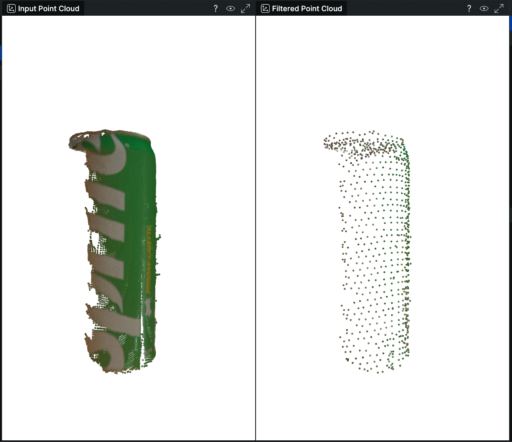

<div align="center">
  <p>
    <a align="center" href="https://github.com/telekinesis-ai" target="_blank">
      
    </a>
  </p>

  <br>

  <a href="https://github.com/telekinesis-ai/telekinesis-examples">Telekinesis Examples</a> |
  <a href="https://github.com/telekinesis-ai/telekinesis-data">Telekinesis Data</a>
  <br>

  <!-- <a href="https://pypi.org/project/telekinesis-ai/">
    
  </a>
  
  <a href="https://pypi.org/project/telekinesis-ai/">
    
  </a> -->
</div>

# Telekinesis Examples

This directory contains **example scripts** demonstrating how to use the **Telekinesis SDK (Python)** for robotics and computer vision workflows.

These examples focus on **practical usage** of Telekinesis APIs, including:

* point clouds and meshes
* 3D geometry processing
* perception utilities
* optional 3D visualization

---

## Prerequisites

We recommend completing the [Telekinesis SDK Quickstart](https://docs.telekinesis.ai/getting-started/quickstart) to set up your system. 

This ensures that:
- Your `TELEKINESIS_API_KEY` is correctly configured
- The Telekinesis SDK is installed
- Your first example is already set up successfully

---

## Running Examples

### Quick start example

Run a simple example to verify everything is working:

```bash
python examples/vitreous_examples.py --example filter_point_cloud_using_voxel_downsampling
```

Expected output:
```bash
2025-12-17 17:59:58.437 | SUCCESS  | __main__:main:4783 - Running filter_point_cloud_using_voxel_downsampling example...
2025-12-17 17:59:58.852 | SUCCESS  | __main__:filter_point_cloud_using_voxel_downsampling_example:2998 - Filtered points using voxel downsampling
```

This will also open a `rerun` visualization window showing the input point cloud and the filtered output point cloud.

<div style="display: flex; flex-direction: column; gap: 20px; margin: 20px 0;">
  <div style="flex: 1;">
    <h4>Output:</h4>
    </img>
  </div>
</div>

### List available examples
```bash
python examples/vitreous_examples.py --list
```

This will display all available examples, such as:
- `calculate_axis_aligned_bounding_box`
- `calculate_oriented_bounding_box`
- `calculate_point_cloud_centroid`
- `cluster_point_cloud_using_dbscan`
- `convert_mesh_to_point_cloud`
- `filter_point_cloud_using_voxel_downsampling`
- ... and many more


### Run a specific example
```bash
python examples/vitreous_examples.py --example calculate_axis_aligned_bounding_box
```

The example name should be provided **without** the `_example` suffix.

### Run all examples
```bash
python examples/vitreous_examples.py --all
```

To pause between examples:
```bash
python examples/vitreous_examples.py --all --pause
```

---

## Example Categories

Examples are organized by functionality and common workflows:

* **Point Cloud Calculations**
  * Axis-aligned and oriented bounding boxes
  * Centroids and point counting
  * Plane normal estimation
  * Principal axes estimation

* **Point Cloud Filtering**
  * Pass-through, bounding box, and mask-based filtering
  * Outlier removal (statistical and radius-based)
  * Downsampling (uniform and voxel-based)
  * Plane-based filtering and splitting
  * Cylinder base removal
  * Viewpoint visibility filtering

* **Point Cloud Clustering & Segmentation**
  * DBSCAN clustering
  * Density-based clustering
  * Color-based segmentation
  * Plane-based segmentation
  * Vector proximity segmentation

* **Point Cloud Transformations**
  * Adding and subtracting point clouds
  * Scaling and applying transforms
  * Projecting to planes

* **Point Cloud Registration**
  * Centroid-based translation
  * ICP registration (point-to-point, point-to-plane)
  * Fast global registration
  * Rotation and cuboid translation samplers

* **Mesh Operations**
  * Creating primitive meshes (cylinder, plane, sphere, torus)
  * Converting meshes to point clouds
  * Reconstructing meshes from point clouds (convex hull, Poisson)

* **Visualization (Optional)**
  * Rerun-based 3D visualization
  * Camera controls and overlays

All examples include optional visualization sections that can be removed if only numerical output is needed.

---

## Directory Structure

```text
telekinesis-examples/
├── examples/
│   └── vitreous_examples.py    # Main examples script with all example functions
├── telekinesis-data/           # Git submodule containing example data files
│   ├── point_clouds/           # PLY point cloud files
│   ├── meshes/                 # GLB mesh files
│   └── images/                 # Image files
├── README.md                   # This file
├── LICENSE.txt                 # License file
└── .gitmodules                 # Git submodule configuration
```
All examples are contained within `vitreous_examples.py`. Use the `--list` flag to see all available examples.
The data path is configured in `examples/vitreous_examples.py` on line 16. By default, it points to `telekinesis-data/` in the repository root. To use a custom data location, modify the `DATA_DIR` variable.

---

## Documentation
Full SDK documentation is available at: [https://docs.telekinesis.ai/](https://docs.telekinesis.ai/)

## Support

For issues and questions:
- Create a GitHub issue
- Contact the Telekinesis development team

<p align="center">
  <a href="https://github.com/telekinesis-ai">GitHub</a>
  &nbsp;•&nbsp;
  <a href="https://www.linkedin.com/company/telekinesis-ai/">LinkedIn</a>
  &nbsp;•&nbsp;
  <a href="https://x.com/telekinesis_ai">X</a>
  &nbsp;•&nbsp;
  <a href="https://discord.gg/7NnQ3bQHqm">Discord</a>
</p>
