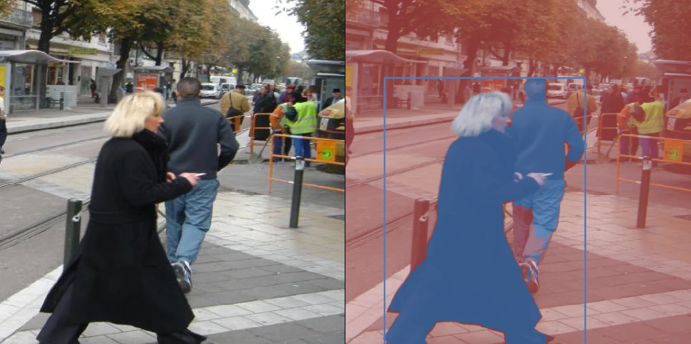

<div align="center">
  <p>
    <a href="https://github.com/telekinesis-ai">
      
    </a>
  </p>

  <p align="center">
    <a href="https://pypi.org/project/telekinesis-ai/">
      
    </a>
    <a href="https://pypi.org/project/telekinesis-ai/">
      
    </a>
    <a href="https://pypi.org/project/telekinesis-ai/">
      
    </a>
    <a href="https://docs.telekinesis.ai">
      
    </a>
  </p>

  <h2>Any robot. Any task. One Physical AI platform.</h2>

  <p>
    <a href="https://docs.telekinesis.ai/">Telekinesis Docs</a>
    &nbsp;•&nbsp;
    <a href="https://discord.gg/S5v8bYAnc6">Discord</a>
    &nbsp;•&nbsp;
    <a href="https://www.linkedin.com/company/telekinesis-ai/">LinkedIn</a>
    &nbsp;•&nbsp;
    <a href="https://x.com/telekinesis_ai">X</a>
    &nbsp;•&nbsp;
    <a href="https://telekinesis.ai/">Website</a>

</p>
</div>

# Telekinesis Examples

The **Telekinesis Agentic Skill Library** is a Python library of composable Skills - atomic perception, planning, and control operations - for agentic robotics, computer vision, and Physical AI systems, including LLM/VLM-driven task planning grounded in real perception and control.

This repository contains standalone, chainable Python examples of those Skills. Full documentation: [docs.telekinesis.ai](https://docs.telekinesis.ai/).

Available skills:

```python
from telekinesis import synapse    # robotics skills
from telekinesis import cornea     # image segmentation skills
from telekinesis import retina     # object detection skills
from telekinesis import pupil      # image processing skills
from telekinesis import vitreous   # point cloud processing skills
from telekinesis import medulla    # sensor interface skills
from telekinesis import axon       # camera calibrations
from telekinesis import dataengine # data logging
from telekinesis import datatypes  # shared data structures
from telekinesis import babyros    # pub/sub communication interface
from telekinesis import rlbotics   # reinforcement learning
```

`babyros` and `rlbotics` are available as separate repos:

- [telekinesis-rlbotics](https://github.com/telekinesis-ai/telekinesis-rlbotics)
- [babyros](https://github.com/telekinesis-ai/babyros)

## Requirements

- Python 3.11 or 3.12
- A free [Telekinesis API key](https://platform.telekinesis.ai/api-keys), exported as `TELEKINESIS_API_KEY`:

  ```bash
  # macOS / Linux
  export TELEKINESIS_API_KEY="your_api_key"
  ```

  ```powershell
  # Windows (restart your terminal afterward)
  setx TELEKINESIS_API_KEY "your_api_key"
  ```

  For guidance on setting up the `TELEKINESIS_API_KEY`, see the [setup video](https://www.youtube.com/watch?v=8HzUZq773mE).

## Quickstart

> **Note:** Make sure you have your `TELEKINESIS_API_KEY` set up first - see [Requirements](#requirements).

Follow the steps below to quickly install and run an example:

```bash
cd telekinesis-examples

pip install telekinesis-ai

python examples/synapse/quickstart_set_cartesian_pose_abb.py   # Synapse robotics example, no hardware required
```

For a complete walkthrough, refer to the [Quickstart guide](https://docs.telekinesis.ai/getting-started/quickstart.html).

## Getting Started

Follow below detailed steps to easily integrate the **Telekinesis Agentic Skill Library** into your own application.

### Step 1: Set Up Your API Key

See [Requirements](#requirements) for the API key setup.

### Step 2: Install the Telekinesis Agentic Skill Library

1. Create an isolated environment so there are no dependency conflicts. We recommend installing a `Miniconda` environment by following the instructions [here](https://docs.conda.io/en/latest/miniconda.html#installing).

2. Create a new `conda` environment called `telekinesis` and activate it:
    ```bash
    conda create -n telekinesis python=3.11
    conda activate telekinesis
    ```

3. Install the library using `pip`:

    We support Python 3.11 and 3.12.

    ```bash
    pip install telekinesis-ai
    ```

### Step 3: Run Your First Example

1. Change into the repository directory:

    ```bash
    cd telekinesis-examples
    ```
2. Run the [segment_image_using_sam](https://docs.telekinesis.ai/skills/cornea/segment_image_using_sam.html) example:

    ```bash
    python examples/segmentation/segment_image_using_sam.py
    ```

    If the example runs successfully, a **Rerun** visualization window will open showing the input and filtered point cloud.

    

### Step 4: Run Other Examples

To run other examples, learn more about each Skill Group and how to use them:

| Module | Description | Status |
|--------|-------------|--------|
| [**Synapse**](https://docs.telekinesis.ai/skills/synapse/overview.html) | Motion planning, kinematics, control | Released |
| [**Cornea**](https://docs.telekinesis.ai/skills/cornea/overview.html) | Image segmentation | Released |
| [**Retina**](https://docs.telekinesis.ai/skills/retina/overview.html) | Object detection (foundation models, classical) | Released |
| [**Pupil**](https://docs.telekinesis.ai/skills/pupil/overview.html) | 2D image processing | Released |
| [**Vitreous**](https://docs.telekinesis.ai/skills/vitreous/overview.html) | 3D point cloud & mesh processing | Released |
| [**Medulla**](https://docs.telekinesis.ai/skills/medulla/overview.html) | Hardware communication (cameras & sensors) | Released |
| [**Axon**](https://docs.telekinesis.ai/skills/axon/overview.html) | Camera calibrations | Released |
| [**DataEngine**](https://docs.telekinesis.ai/data-engine/introduction.html) | Data logging & MCAP | Released |
| [**Datatypes**](https://docs.telekinesis.ai/data-engine/datatypes/overview.html) | Shared data structures | Released |


```bash
# Computer vision (run the script directly)
python examples/segmentation/segment_image_using_rgb.py                         # Cornea
python examples/detection/detect_objects_using_grounding_dino.py                # Retina
python examples/image_processing/filter_image_using_morphological_gradient.py   # Pupil
python examples/point_cloud/estimate_principal_axes.py                          # Vitreous

# Robotics
python examples/synapse/motion/set_cartesian_pose/set_cartesian_pose.py         # Synapse motion
python examples/synapse/kinematics/forward_kinematics.py                        # Synapse kinematics

# Hardware
python examples/sensors/webcam/capture_image_example.py                         # Medulla (webcam)

# Calibration - NOTE: THIS NEEDS HARDWARE ROBOT and CAMERA
python examples/calibration/calibrate_eye_in_hand.py                            # Axon (eye-in-hand calibration)

# Data Engine
python examples/dataengine/detection/tutorial.py                                # DataEngine (logging & MCAP)

# Datatypes
python examples/datatypes/image_example.py                                      # Datatypes
```

## The Telekinesis Community

Telekinesis Agentic Skill Library is just the beginning. We're building a community of contributors who grow the Physical AI Skill ecosystem—researchers, hobbyists, and engineers alike. If you have a Skill, we want to see it. Release it, let others use and improve it, and watch it deploy in real-world systems.

[Join our Discord community](https://discord.gg/S5v8bYAnc6) to connect, share, and build together.

## Documentation

- Full documentation: [docs.telekinesis.ai](https://docs.telekinesis.ai/)
- Tutorials: [Tutorials overview](https://docs.telekinesis.ai/getting-started/tutorials/overview.html)
- API reference: [telekinesis.gitlab.io/telekinesis](https://telekinesis.gitlab.io/telekinesis/)

## Support

- [GitHub Issues](https://github.com/telekinesis-ai/telekinesis-examples/issues) — Report bugs or request features
- [Create API Key](https://platform.telekinesis.ai/api-keys) — Get started with the Telekinesis platform
- [Discord](https://discord.gg/S5v8bYAnc6) — Community support and discussions

